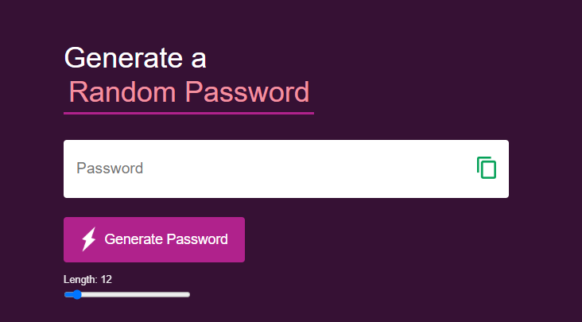
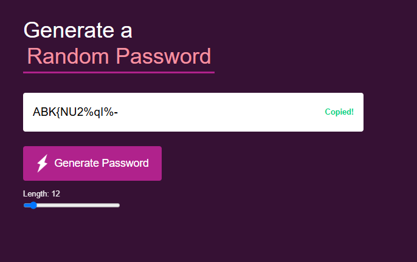

Available in: [🇯🇵 日本語はこちら](README.ja.md)

# 🔐 Password Generator App

A simple and beginner-friendly web app to create secure random passwords using **HTML**, **CSS**, and especially **JavaScript**.

---

## What I Learned

This project was mainly focused on **JavaScript logic** and **DOM interaction**.

### JavaScript Skills Gained
- **DOM Selection & Interaction**
  - Using `document.getElementById()` to grab and control elements
  - Updating element values with `.value` and `.textContent`
- **Event Handling**
  - Adding listeners for `click` (buttons, icons) and `input` (slider)
  - Real-time updates to slider value without reloading
- **Password Generation Logic**
  - Creating a **character pool** combining uppercase, lowercase, numbers, and symbols
  - Using `Math.random()` and `Math.floor()` to select random characters
  - Looping with `for` to build a password string of desired length
  - Default value handling with `Number()` and fallback length
- **Clipboard Operations**
  - Using `navigator.clipboard.writeText()` to copy to the system clipboard
  - Providing instant feedback by toggling “Copied!” message visibility
  - Resetting UI state after a short delay using `setTimeout()`
- **UI Feedback Control**
  - Showing/hiding elements via `style.display`
  - Making interactive elements feel responsive to user actions

### HTML & CSS (Supportive Skills)
- HTML: Basic structure, input fields, buttons, and labels
- CSS: Flexbox for alignment, custom colors, hover styles, and responsive layout

---

## Features

- Adjustable password length (8–64) via slider
- One-click random password generation
- One-click copy with visual confirmation
- Clean, responsive design for desktop & mobile
- Easy customization of color themes and styles

---

## Folder Structure
```
Password-Generator/
├── images/
├── js/
├── css/
├── index.html
└── README.md
```

---

## How It Works

1. The **length slider** sets the number of characters.
2. **Generate Password** creates a loop, randomly picking characters from the pool until the desired length is reached.
3. Password is displayed instantly in the input field.
4. Clicking the copy icon copies it to the clipboard and shows a “Copied!” message for 1 second.

---

## Live Demo

[🔗 View Demo](https://passwordgenerator1630.netlify.app)

---

## Preview




---

## Future Plans

- Add **Strong Mode** requiring at least one uppercase, lowercase, number, and symbol
- Toggle to exclude ambiguous characters (`O`/`0`, `l`/`1`)
- Add dark/light mode toggle
- Save previous settings using `localStorage`

---

## Author

**Aman Rai**  
Beginner Web Developer focusing on JavaScript  
Tokyo, Japan  
Languages: English, Hindi, Nepali, Japanese (N3)